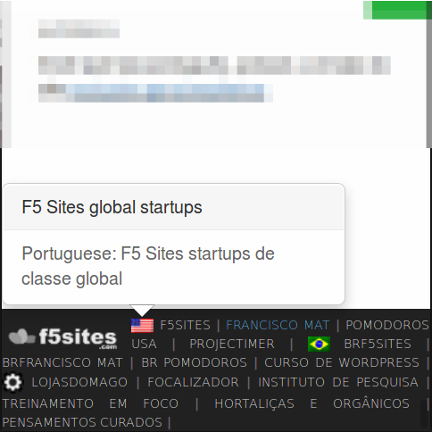

# F5 Sites Footer Bar
by Francisco Mat

Create an shared footer element, with inner links, across multiple domains, if you host many sites under same servers. Just put it on mu-plugins and style it editing the single file php code, made to be simple for developers. WordPress F5 Sites DEV projects 

