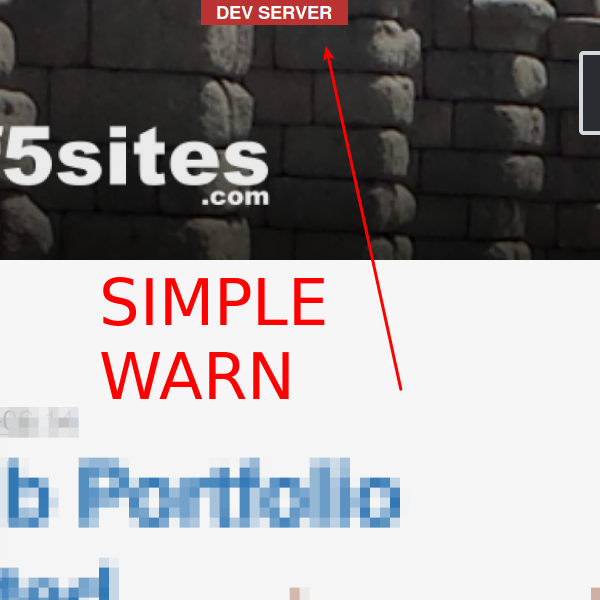

# F5 Localhost Warning
by Francisco Mat

Tired of not knowing when on development server? WordPress F5 Sites DEV projects.

HOT TO USE

create an empty file "localhost" in plugin dir if is localhost

